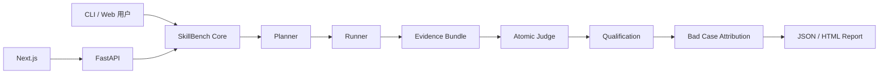

# 系统架构

SkillBench 采用“一个核心、三个入口”：CLI、FastAPI 和 Next.js 都调用 `src/skillbench`，不复制评测逻辑。



## 核心模块

- `planner.py`：验证冻结状态并生成唯一运行计划；
- `runner.py`：保存输入、响应、Trace 和 completion，不负责打分；
- `evidence.py`：重算哈希，证明证据未被篡改；
- `judge.py`：对一个断言输出一个 verdict 与证据引用；
- `qualification.py`：在计分前检查运行、资产、Skill 和证据；
- `attribution.py`：按因果顺序寻找第一个偏离点；
- `report.py`：聚合已具备资格的运行并生成报告。

## 数据如何整合

数据不是把多个文件简单拼接，而是通过稳定标识关联：

```text
experiment_id
  └─ case_id
      └─ run_id = case + skill + condition + model + repetition
          ├─ input.json
          ├─ response.json
          ├─ trace.json
          └─ completion.json
```

`run_id` 连接计划与运行目录；`case_id` 连接公开输入与 Rubric；`input_sha256`、`response_sha256` 连接运行内容与 Trace；报告再把 Judge、Qualification 和 Attribution 附着到同一个运行记录。

## 关键边界

- Runner 与 Judge 解耦，避免“执行失败即判模型失败”；
- 运行目录只追加，重复 `run_id` 会被拒绝；
- 离线演示无需凭证；
- 在线 Adapter 不得在 import 时初始化，也不得硬编码代理地址；
- 私有 Holdout、GT、原始对话和第三方 Skill 不进入本仓库。

